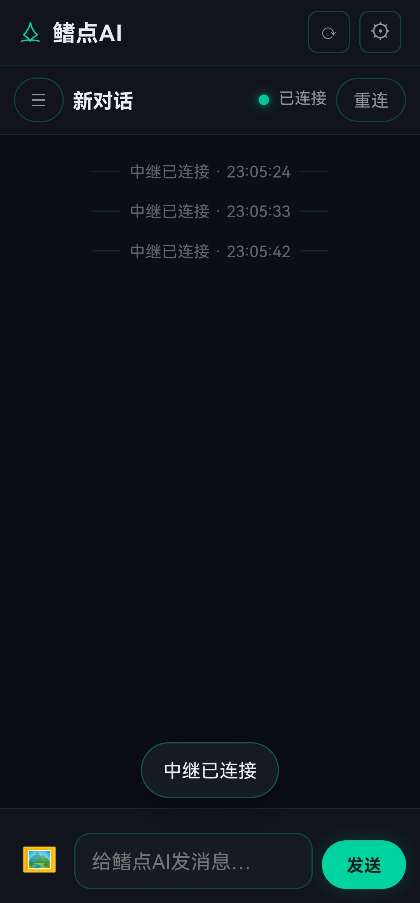
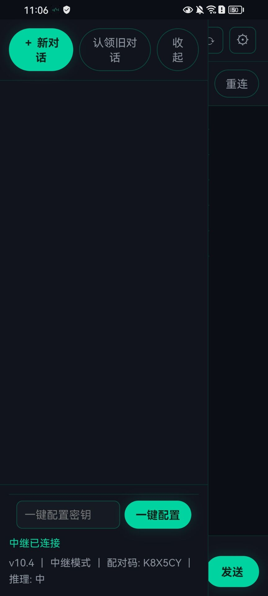
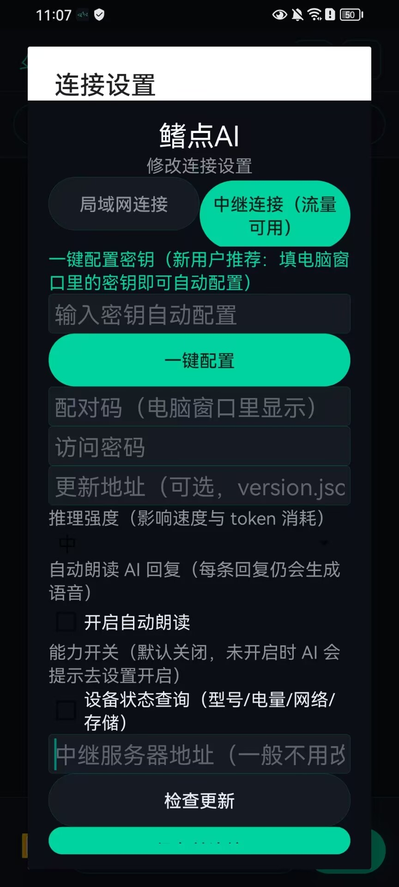

> 初，帝以一手机起家，
> 夜召 AI 谋事，遂有天下。
> 然，天下未定，亦未一统；
> 不求独坐江山，惟愿人民安康富庶。
>
> In the beginning, the Emperor started with a single phone, summoned AI by night to plan, and thus won the realm. Yet the realm is not settled, nor fully united; the wish is not to sit alone on the throne, but that the people live in peace and prosperity.
>
> —— 这是本软件的初心 · This is the founding aspiration of this software

© 2026 add，本项目为个人开源项目，保留所有权利。 · © 2026 add. All rights reserved. This is a personal open-source project.

本软件基于 GPL-3.0 许可发布，详见 LICENSE 文件。 · Released under the GPL-3.0 license. See the LICENSE file.

# 鳍点AI（DeepSeek 版）· Qidian AI (DeepSeek Edition)

[English](README.en.md) · 中文

一个不用登录 ChatGPT 账号、直接用手机控制电脑上 Codex 的小工具。模型仍然走你电脑上配置的 DeepSeek 接口，对话、发图片、看结果、批准命令都在手机上完成。

A small tool that lets you control Codex on your PC directly from your phone, without logging into a ChatGPT account. The model still uses the DeepSeek endpoint configured on your computer — chat, send images, view results, and approve commands all happen on your phone.

## 它做了什么 · What it does

它在你电脑上启动一个“中转服务”，并连接你电脑自带的 Codex 程序。你的手机浏览器打开一个网页，就能：

It runs a "bridge service" on your computer and connects to the Codex program already installed there. Open a web page on your phone and you can:

- 新建对话、继续之前的对话 · Start new conversations or continue previous ones
- 发送文字、上传手机里的图片 · Send text and upload images from your phone
- 实时看到 Codex 的回复、命令执行和文件修改 · Watch Codex replies, command executions, and file changes in real time
- 需要批准的命令会弹到手机上，一键允许/拒绝 · Approve or reject privileged commands with one tap when they pop up on your phone
- 随时停止正在运行的任务 · Stop a running task at any time
- AI 回复可自动/手动“朗读”（需先在电脑上启动小云离线语音服务） · Have AI replies read aloud automatically or manually (requires the local "Xiaoyun" offline voice service on your PC)

所有代码和文件都只在你自己的电脑上运行，不上传任何服务器。

All code and files run only on your own computer; nothing is uploaded to any server.

## 界面预览 · Screenshots

整套界面是“深海暗夜 + 霓虹线稿”风格：深蓝黑背景、青绿单线描边、圆角克制、无阴影堆砌。

The UI follows a "deep-sea dark + neon line art" style: dark blue-black background, teal single-line outlines, restrained rounded corners, and no heavy shadows.



**主聊天界面**：顶部是鲨鱼线稿图标和“鳍点AI”，右上角是刷新与设置；连接状态用发光圆点表示（青绿=已连接），旁边有重连按钮。中间是对话区，底部输入框支持文字和图片，右侧青绿色“发送”按钮。

**Main chat screen**: shark line-art logo and "鳍点AI" at the top, with refresh and settings on the right. Connection status is shown as a glowing dot (teal = connected) next to a reconnect button. The composer at the bottom supports text and images, with a teal "Send" button.



**侧栏**：顶部“+ 新对话”“认领旧对话”“收起”三个入口；底部是一键配置密钥区（新用户填电脑窗口里的密钥即可自动配对）；最下方显示版本号、当前模式、配对码和推理强度，状态栏会实时提示“中继已连接”。

**Sidebar**: "+ New Chat", "Claim Old Chat", and "Collapse" entries at the top; a one-click configuration key area at the bottom (new users paste the key shown in the PC window to pair automatically); the version, current mode, pairing code, and reasoning effort are shown at the bottom with live relay status.



**连接设置**：可选择“局域网连接”（同一 Wi-Fi）或“中继连接”（户外流量可用）；支持一键配置密钥、手动填写配对码/密码/更新地址；还可以设置推理强度、自动朗读 AI 回复，以及逐项开启“能力开关”（如设备状态查询，默认关闭，AI 未开启时会提示去设置打开）。

**Connection settings**: choose "LAN connection" (same Wi-Fi) or "Relay connection" (works over mobile data outdoors); one-click key configuration, or manual pairing code / password / update URL; reasoning effort, auto-read-aloud, and per-feature "capability switches" (e.g. device status, off by default — the AI will ask you to enable it in settings if it is not on).

## 怎么启动 · Getting started

1. 双击 `start.bat`（如果打不开，就右键 `start.ps1` → 用 PowerShell 运行）。 · Double-click `start.bat` (if it does not open, right-click `start.ps1` → Run with PowerShell).
2. 窗口里会显示两个地址 · The window shows two addresses:
   - 电脑上打开：`http://localhost:8787` · On your PC: `http://localhost:8787`
   - 手机上打开：`http://电脑IP:8787`（手机和电脑连同一个 Wi-Fi） · On your phone: `http://PC-IP:8787` (phone and PC on the same Wi-Fi)
3. 手机浏览器打开那个地址，输入启动窗口里显示的访问密码（首次运行会自动生成随机密码）。 · Open that address on your phone and enter the access password shown in the startup window (a random password is generated automatically on first run).
4. 在手机上点「新对话」，开始使用。 · Tap "New Chat" on your phone and start using it.

注意：这个黑色窗口不能关，关掉服务就停了。 · Note: keep the black window open — closing it stops the service.

## 安装 APK（安卓手机）· Installing the APK (Android)

文件夹里已经打好一个安卓安装包：`CodexPhoneBridge.apk`。 · A ready-built APK (`CodexPhoneBridge.apk`) is included in the release package.

1. 把 `CodexPhoneBridge.apk` 传到手机上（微信/QQ 传文件、数据线、网盘都行）。 · Transfer it to your phone (WeChat/QQ file transfer, USB cable, cloud drive, etc.).
2. 在手机上点击安装。第一次安装如果提示“未知来源”，允许即可。 · Tap to install. If prompted about "unknown sources" on first install, allow it.
3. 打开 App，第一次会要求选择连接方式 · On first launch, choose a connection mode:
   - 「局域网连接」：手机和电脑连同一个 Wi-Fi 时用，填启动窗口里的地址，例如 `http://192.168.2.161:8787` · "LAN connection": use when the phone and PC share the same Wi-Fi. Enter the address shown in the startup window, e.g. `http://192.168.2.161:8787`
   - 「中继连接（流量可用）」：在户外、用手机流量也能用，填启动窗口里显示的「配对码」和访问密码 · "Relay connection (mobile data)": works outdoors over mobile data. Enter the pairing code and access password shown in the startup window.
4. 保存后就能用了，以后每次打开直接进对话界面。 · Save and you are ready — the app opens straight into the chat screen next time.

顶部有「刷新」和「设置」两个按钮，设置里可以随时改电脑地址，也可以开关「自动朗读 AI 回复」。 · There are "Refresh" and "Settings" buttons at the top; settings let you change the PC address and toggle auto read-aloud for AI replies.

## 检查更新（一键更新）· Checking for updates (one-click updates)

手机 App 的设置里有一行「更新地址」和一个「检查更新」按钮。要让“一键更新”生效，需要把新版本文件放到一个固定网址上（推荐免费注册 GitHub，用它的 Releases 功能），然后把 version.json 的网址填到：

The phone app has an "Update URL" field and a "Check update" button in settings. To make one-click updates work, put new version files at a fixed URL (a free GitHub account with Releases is recommended) and fill in the `version.json` URL at:

- 手机 App 设置 → 更新地址 · Phone app settings → Update URL
- 电脑 `config.json` → `updateUrl` · PC `config.json` → `updateUrl`

> 注意：默认更新地址指向作者仓库 `oen1day/codex-phone-bridge`。如果你 fork 或二次开发，请把电脑 `config.json` 的 `updateUrl` 和手机设置里的更新地址改成你自己的，否则会检查到作者的版本。别人「检查更新」只是向 GitHub 发一个 GET 请求，不会占用或影响你的服务。
>
> Note: the default update URL points to the author's repository `oen1day/codex-phone-bridge`. If you fork or build your own version, change `updateUrl` in the PC `config.json` and the update URL in the phone settings to your own, otherwise it will check against the author's releases. Checking for updates is just a GET request to GitHub and does not use or affect the author's service.

version.json 的内容格式 · `version.json` format：

```json
{
  "version": "1.3",
  "pcZip": "https://你的网址/电脑端.zip · https://your-url/pc.zip",
  "apk": "https://你的网址/手机.apk · https://your-url/phone.apk"
}
```

电脑启动时会自动检查并提示新版本；手机点「检查更新」会提示，并直接打开新版 APK 的下载安装页面。 · The PC checks for new versions on startup; the phone "Check update" button shows the result and opens the new APK download/install page.

## 一键发布到 GitHub（推荐）· One-click publishing to GitHub (recommended)

电脑端文件夹里已经放好 `publish-update.ps1` 脚本，它会自动完成：创建公开仓库、把更新地址写进 config.json、生成新的电脑端压缩包、上传 version.json、发布 Release 并上传两个安装包。

The `publish-update.ps1` script is included. It creates a public repository, writes the update URL into `config.json`, builds a new PC zip, uploads `version.json`, and publishes a Release with both install packages.

你只需要三步 · Three steps:

1. 安装 GitHub 命令行工具 · Install the GitHub CLI (run in your terminal): `winget install --id GitHub.cli`
2. 登录一次 · Log in once: `gh auth login`
3. 运行脚本：右键 `publish-update.ps1` → 用 PowerShell 运行 · Run the script: right-click `publish-update.ps1` → Run with PowerShell

脚本会自动从你的 git 配置读取 GitHub 用户名（当前是 `oen1day`）。如果不对，会提示你手动输入。运行完成后，把脚本最后打印的那个网址填进手机 App 设置 → 更新地址即可。注意：解压后的文件夹里已经包含手机 APK，脚本会把它和电脑端压缩包一起上传，不需要你另外准备文件。

The script reads your GitHub username from your git config (currently `oen1day`). If it is wrong, it will ask you to type it. When finished, paste the URL it prints into the phone app settings → Update URL. Note: the extracted folder already contains the phone APK; the script uploads it together with the PC zip.

## 手机用流量（在外面）能不能连？· Can I use it over mobile data (outdoors)?

能，这个版本已经内置了“中继”功能 · Yes — this version has a built-in "relay" feature:

1. 电脑上照常双击 `start.bat`，记下窗口里的「配对码」和「密码」。 · Start `start.bat` on your PC as usual and note the pairing code and password in the window.
2. 手机 App 里选择「中继连接（流量可用）」，输入配对码和密码。 · In the phone app, choose "Relay connection (mobile data)" and enter the pairing code and password.
3. 之后不管手机用 Wi-Fi 还是流量，都能连上电脑的 Codex。不需要公网 IP、不用买服务器、也不用再装 Tailscale。 · After that the phone can reach your PC's Codex over Wi-Fi or mobile data. No public IP, no server, no Tailscale needed.

说明：中继模式的消息会经过一个免费公共中继服务器，内容已经用你的密码加密，别人看不到；速度取决于中继服务网络。 · Note: relay traffic goes through a free public relay broker. Content is encrypted with your password, so others cannot read it; speed depends on the relay network.

备选（更稳定，但要装一个免费软件）：Tailscale · Alternative (more stable, requires a free app): Tailscale

1. 电脑装 Tailscale（https://tailscale.com/download），用你的账号登录。 · Install Tailscale on your PC and sign in.
2. 手机装 Tailscale App，登录同一个账号。 · Install the Tailscale app on your phone and sign in with the same account.
3. 登录后电脑会得到一个 `100.x.x.x` 的虚拟地址（在 Tailscale 界面里能看到）。 · Your PC gets a `100.x.x.x` virtual address (visible in the Tailscale UI).
4. 手机 App 选择「局域网连接」，地址填 `http://100.x.x.x:8787`。 · In the phone app choose "LAN connection" and enter `http://100.x.x.x:8787`.

## 语音朗读（TTS）依赖 · TTS (read-aloud) dependency

语音朗读依赖你本机部署的 IndexTTS-2 离线语音服务（Apache-2.0）。克隆音色素材“小云”不随本仓库发布；你需要自行部署语音服务，并在 `config.json` 里配置 `ttsUrl`（服务地址）和 `ttsPythonPath`（Python 解释器路径）。未配置时朗读功能会提示不可用，不影响其余功能。

Read-aloud requires a local IndexTTS-2 offline voice service (Apache-2.0). The cloned "Xiaoyun" voice assets are not distributed with this repository. You need to deploy the voice service yourself and configure `ttsUrl` (service URL) and `ttsPythonPath` (Python interpreter path) in `config.json`. Without it, the read-aloud feature reports it is unavailable; everything else keeps working.

## 修改设置 · Configuration

用记事本打开 `config.json` · Open `config.json` in a text editor:

- `password`：访问密码，改成你自己的（重要） · access password — change it to your own (important)
- `port`：端口，默认 8787 · port, default 8787
- `workspace`：Codex 的工作目录（首次运行默认取“用户目录/Documents/Codex”，可自行修改） · Codex working directory (defaults to `Documents/Codex` on first run)
- `model`：模型名，留空就是用你电脑上配置的默认模型（DeepSeek） · model name; leave empty to use the default model configured on your PC (DeepSeek)
- `approvalPolicy`：审批策略 · approval policy
  - `on-request`：每个要权限的命令都会问你（推荐） · ask for every privileged command (recommended)
  - `never`：不询问，直接执行（方便但危险） · run without asking (convenient but dangerous)
  - `reject`：一律拒绝 · always reject
- `sandbox`：沙箱级别 · sandbox level
  - `workspace-write`：只能改工作目录里的文件（推荐） · can only modify files in the working directory (recommended)
  - `danger-full-access`：可以操作整台电脑（危险） · can operate on the whole computer (dangerous)
  - `read-only`：只能读不能改 · read-only
- `transport`：`spawn`（默认，自己启动 Codex）；`proxy`（连接已经运行的 Codex 服务，适合高级用户） · `spawn` (default, starts Codex itself); `proxy` (connects to an already-running Codex service, for advanced users)
- `relayEnabled`：是否开启内置中继（默认开启，手机流量连接用） · enable the built-in relay (default on, used for mobile data connections)
- `relayBroker`：中继服务器地址，一般不用改 · relay broker address, usually leave unchanged
- `relayRoomCode`：手机配对码，程序会自动生成，也可以自己改成六位字母数字 · phone pairing code, auto-generated; you can set any six alphanumeric characters

改完保存，重新运行 `start.bat`。 · Save the file and restart `start.bat`.

## 电脑上的配对码在哪里看？· Where do I find the pairing code on my PC?

双击 `start.bat` 后，窗口里会显示一行「手机配对码(流量用): XXXXXX」，这就是手机 App 中继连接要填的配对码。配对码在 `config.json` 的 `relayRoomCode` 里，也可以手动改成你自己喜欢的六位字母数字。

After double-clicking `start.bat`, the window shows a line "手机配对码(流量用): XXXXXX" — that is the pairing code for the phone relay connection. It is stored in `relayRoomCode` in `config.json` and can be changed to any six alphanumeric characters.

## 常见问题 · FAQ

**手机打不开网页 · The phone cannot open the web page**
确认手机和电脑在同一 Wi-Fi，且电脑防火墙允许 8787 端口（第一次运行如果弹出防火墙提示，点允许）。 · Make sure the phone and PC are on the same Wi-Fi and the Windows firewall allows port 8787 (allow it when prompted on first run).

**显示“Codex 连接失败” · "Codex connection failed"**
确认 `config.json` 里的 `codexPath` 留空（程序会自动找），并确认电脑上安装的是新版 Codex 桌面软件。 · Make sure `codexPath` in `config.json` is empty (the program auto-detects it) and that a recent version of the Codex desktop app is installed.

**为什么和电脑桌面上的对话不是同一个？ · Why is this different from the conversations on my desktop?**
这个工具默认使用自己新建的对话，方便起见和桌面软件互不干扰。它用的工作目录和模型（DeepSeek）和桌面端一致。 · This tool creates its own conversations by default, so it does not interfere with the desktop app. It uses the same working directory and model (DeepSeek) as the desktop.

## 公开版说明 · Public version notes

- 首次运行：若 `config.json` 不存在，程序会自动生成配对码、随机访问密码和配置密钥，并写入 `config.json` 与 `~/.codex/phone-bridge-id.json`；已有配置会原样沿用，不会重置。 · First run: if `config.json` does not exist, the program auto-generates a pairing code, a random access password, and a config key, written to `config.json` and `~/.codex/phone-bridge-id.json`; existing configs are kept as-is and never reset.
- 新手机一键配置：启动后在黑色窗口复制“一键配置密钥”，手机 App 首次界面输入该密钥即可自动完成配对码/密码/更新地址配置。 · One-click pairing for a new phone: copy the "one-click config key" from the black window, paste it into the phone app's first screen, and the pairing code/password/update URL are configured automatically.
- 发布包只包含 `config.example.json` 模板，不包含真实凭据；请勿把 `config.json`、`paths.json`、`debug.keystore` 提交到公开仓库。 · Release packages contain only the `config.example.json` template, never real credentials. Never commit `config.json`, `paths.json`, or `debug.keystore` to a public repository.
- 安全提示：请定期更换访问密码；不要把 `config.json` 和密钥发给不信任的人。 · Security: change your access password regularly; do not share `config.json` or keys with untrusted people.

## 贡献 · Contributing

欢迎任何形式的贡献：提 issue、修 bug、加功能、写文档都可以。 · Contributions of any kind are welcome: issues, bug fixes, features, and documentation.

1. Fork 本仓库，在你自己仓库的 `main` 分支上开发。 · Fork this repository and develop on your own `main` branch.
2. 改动前先跑一遍 `tests/` 下的 7 个验证脚本（smoke-app / autospeak / paging / rebind / capabilities / crashguard / about），确保旧功能不回归。 · Before changing anything, run the 7 verification scripts under `tests/` (smoke-app / autospeak / paging / rebind / capabilities / crashguard / about) to make sure existing features do not regress.
3. 提交时保留源码中的作者暗记与 git 提交暗记（`--by 你的署名`），不要移除或修改版权信息。 · Keep the author watermark in the source and the git commit watermark (`--by your-name`) in your commits; do not remove or alter copyright information.
4. 发起 Pull Request，说明你改了什么、怎么验证的。 · Open a Pull Request and describe what you changed and how you verified it.

界面目前仅支持中文，欢迎提交翻译、贡献其他语言（参考 `README.en.md`）。 · The UI is currently Chinese-only. Translations and other language contributions are welcome (see `README.en.md`).

二次开发提示：如果 fork 后要发布自己的版本，请把电脑 `config.json` 的 `updateUrl` 和手机设置里的更新地址改成你自己的，并遵守 GPL-3.0（分发时同样开源、保留版权声明）。 · Derivative development note: if you fork and publish your own version, change `updateUrl` in the PC `config.json` and the update URL in the phone settings to your own, and comply with GPL-3.0 (distribute under the same license and keep the copyright notice).

## 版权与许可 · Copyright and License

© 2026 add，保留所有权利。 · © 2026 add. All rights reserved.

本项目基于 **GNU GPL-3.0** 许可发布，详见 [LICENSE](LICENSE) 文件。 · This project is released under the **GNU GPL-3.0** license. See the [LICENSE](LICENSE) file.

- 你可以自由使用、修改和分发本软件（包括商业用途） · You may freely use, modify, and distribute this software (including commercially)
- 但只要你分发或售卖本软件（或基于它的修改版本），就必须**同样以 GPL-3.0 开源**，并保留版权与许可声明 · But if you distribute or sell it (or a modified version of it), you must **open-source it under GPL-3.0 as well** and keep the copyright and license notices
- 本软件按“原样”提供，作者不对其适用性、可靠性或安全性提供任何明示或暗示的担保 · This software is provided "as is", without warranty of any kind, express or implied
- 未经作者书面授权，不得移除、遮挡或修改版权、署名与来源信息 · Without the author's written permission, you may not remove, obscure, or modify the copyright, attribution, or source information

## 致谢 · Acknowledgments

- [Codex](https://openai.com/codex/)：本工具的桥接对象 · the software this tool bridges to
- DeepSeek：模型接口（走你电脑上自己配置的配置） · the model endpoint (uses the configuration on your own PC)
- [IndexTTS-2](https://github.com/index-tts/index-tts)（Apache-2.0）：离线语音合成引擎，克隆音色素材“小云”不随本仓库发布 · offline voice synthesis engine; the cloned "Xiaoyun" voice assets are not distributed with this repository
- 免费公共 MQTT 中继服务：让手机在户外也能连回电脑 · free public MQTT relay brokers that let the phone reach the PC from outdoors
